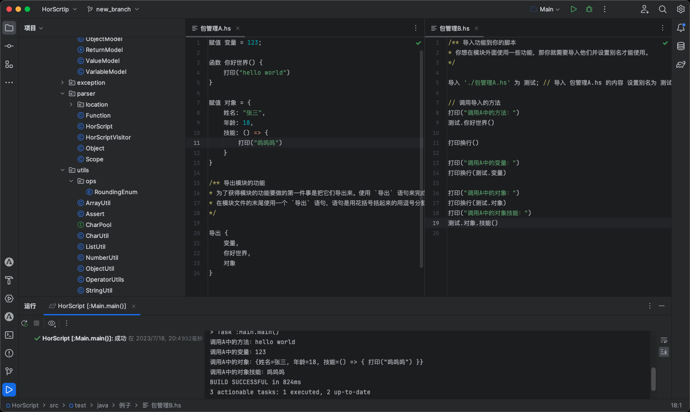

<div align="center"> 
  <a href="#">
    
  </a>

```
 _   _   _____   _____    _____   _____   _____    _   _____   _____  
| | | | /  _  \ |  _  \  /  ___/ /  ___| |  _  \  | | |  _  \ |_   _| 
| |_| | | | | | | |_| |  | |___  | |     | |_| |  | | | |_| |   | |   
|  _  | | | | | |  _  /  \___  \ | |     |  _  /  | | |  ___/   | |   
| | | | | |_| | | | \ \   ___| | | |___  | | \ \  | | | |       | |   
|_| |_| \_____/ |_|  \_\ /_____/ \_____| |_|  \_\ |_| |_|       |_|  
 　　　　
```

<p>
    
    
    
</p>
</div>

### 前言

> 哈喽,大家好 我是 Hor 👨🏻‍💻。


HorScript，它是一种脚本语言，旨在通过提供以 **中文** 来实现直观、灵活的语法来描述的小型编程语言 。

这是一门用 `Java` 编写的一款弱类型的脚本语言，大部分语法参考了 `JavaScript` 以及少量的 `Python` 和 `Java`。

### 环境
- 开发工具:  IDEA
- Java版本: 1.8
- 前端工具:  Antlr
- 构建工具:  Gradle

## 目录结构

以下是系统的目录结构

```
├── static-files                 // 静态文件
├── src
│    ├── main                    
│    │    ├── antlr4             // antlr4 规则文件
│    │    ├── java               
│    │        ├── core           // 核心文件 由 antlr 生成
│    │        ├── domain         // Bean 封装
│    │        ├── exception      // 异常类
│    │        ├── parser         // 解析
│    │        ├── utils          // 工具
│    ├── test                    // 测试入口
└──  build.gradle         // gradle 配置
```

## 特性

- [x] 弱类型定义: 语言中不会要求声明任何形式的类型结构
- [x] 中文关键字: 变量名支持中文
- [x] 数组类型: 可以包括任意数据类型
- [x] 特殊类型 `空`: 等同于其他语言中的 `NULL`
- [x] 类似 `Python` 中 列表,字符串 `切片` 功能
- [x] 函数声明与调用
- [x] `Lambda` 函数
- [x] 闭包: 函数一等公民
- [x] 对象: 类似 `JavaScript` 的 字面量对象
- [x] 包管理: `导入` , `导出`
- [x] 循环与迭代
- [x] 流程控制：表达式计算、条件分支
- [x] 通用语法设计，学习成本极低


## 例子

### Hello world

```
打印("hello world");
> hello world
```


### 杨辉三角形
```
// 杨辉三角形
赋值 rows = 10
循环(i = 0 到 rows) {
    赋值 number = 1
    打印(" " * (rows - i) * 2)
    循环(j = 0 到 i) {
        打印(" " * (4 - 长度(number)),number)
        number = number * (i - j) / (j + 1);
    }
    打印换行();
}

// 结果:
> Task :Main.main()
                       1
                     1   1
                   1   2   1
                 1   3   3   1
               1   4   6   4   1
             1   5  10  10   5   1
           1   6  15  20  15   6   1
         1   7  21  35  35  21   7   1
       1   8  28  56  70  56  28   8   1
     1   9  36  84 126 126  84  36   9   1
   1  10  45 120 210 252 210 120  45  10   1
```

> 
[更多例子](https://github.com/Hor-CN/HorScript/tree/main/src/main/resources)





## 关键字
> 与现有编程语言关键字对照表

|    赋值 - Var    | 导入 - import |    为 - AS    |
|:--------------:|:-----------:|:------------:|
|    函数 - def    | 返回 - return | 断言 - assert  |
|    如果 - if     |  否则 - else  |   循环 - for   |
|  判断循环 - while  |   开始 - do   |    到 - to    |
|     在 - in     |  空 - null   |  打印 - print  |
| 打印换行 - println | 输入 - input  |  长度 - size   |
|     真-true     |  假 - false  | 导出 - export  |


## 文档

> 详情用法请看文档

- [HorScript文档](https://github.com/Hor-CN/HorScript/wiki)


## 协作
如果您想参与此项目，请点击右上角的 `Fork` 按钮，我们共同维护此项目。

## 联系作者

> hor@itbk.cn


## 致谢

- [antlr](https://github.com/antlr/antlr4)

